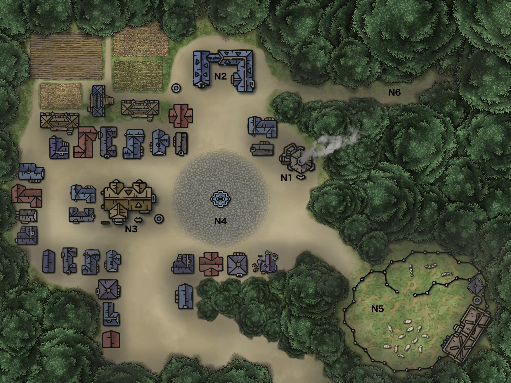
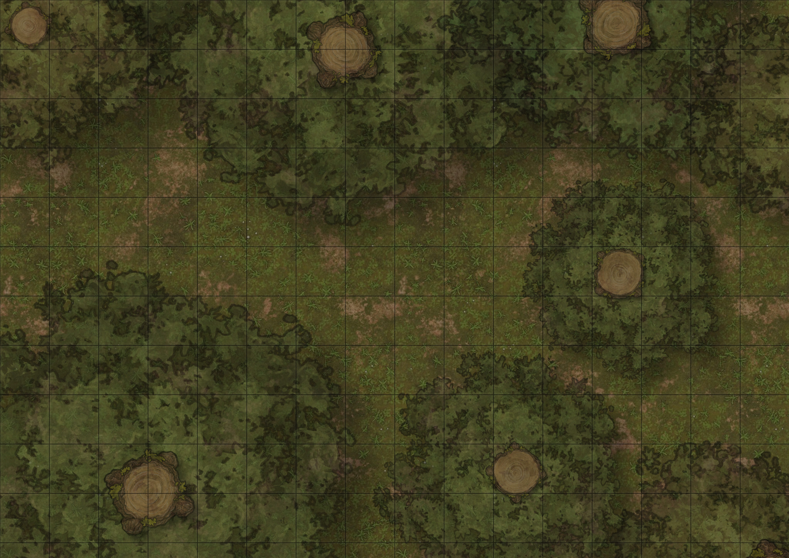
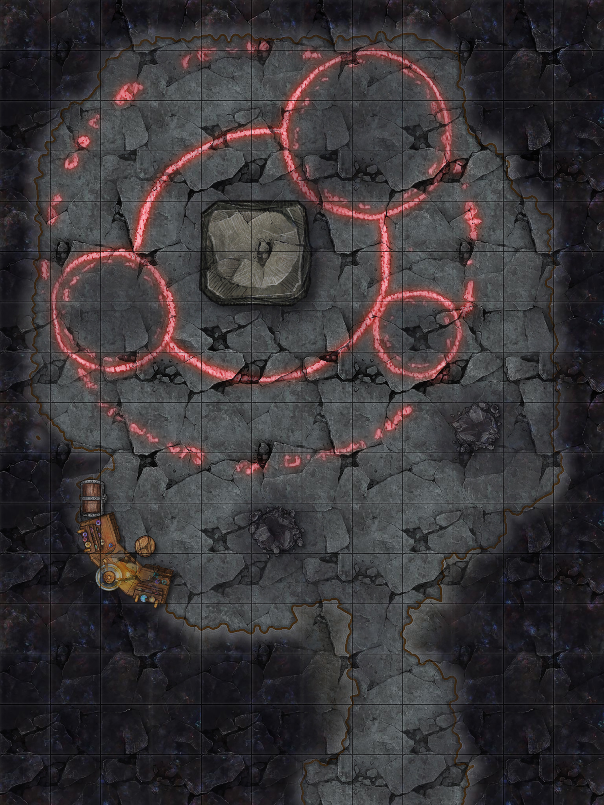

    

## **はじめに** 

このアドベンチャーは５レベルキャラクター３〜５人向けに作成されています。  
プレイ時間は４〜５時間程度を想定しています。  
このアドベンチャーを遊ぶにはDungeons & Dragons第5版のコアルールブックが必要です。  

*本アドベンチャーはファンコンテンツ・ポリシーに沿った非公式のファンコンテンツです。ウィザーズ社の認可/許諾は得ていません。題材の一部に、ウィザーズ・オブ・ザ・コースト社の財産を含んでいます。©Wizards of the Coast LLC.*

## **冒険の背景**  
かつてノクスヴィルの村に「イレナ」という名のヒューマンの薬師がいた。村人たちの病を治し、傷を癒すことで、多くの者に慕われていた。しかし、あるとき、村に原因不明の疫病が流行った。高熱と衰弱に襲われ、多くの村人が次々に倒れていった。
恐れを抱いた村人たちは原因を求め、やがてその矛先は「村で唯一の薬を扱う者」に向けられた。 「イレナが井戸の水に何かを混ぜたのではないか？」 「彼女の薬を飲んだ者が次々に倒れた……」 次第に疑念は確信へと変わり、彼女は村の長老たちの裁きを受けることになる。
「お前が病を広めた……」
身の潔白を証明する間もなく、彼女は村から追放された。
村を追われたイレナは森を彷徨い、誰にも助けを求めることなく、絶望の中で自らの知識を闇の力へと捧げることになる。彼女は誓った……「村を滅ぼし、かつて自分に恐れを向けた者たちに同じ苦しみを味わわせる」と。
その怨念は彼女をハグへと変貌させた。そして影の獣を操る術を身につけた。
村にかつて自分を追い出した者たちがいる限り、彼女の憎しみは消えることはない。

## **プレイ時間の目安**

以下の表は、各セクションの推定プレイ時間と内容の概要を示しています。

| **セクション**               | **推定プレイ時間** | **概要** |
|-----------------------------|------------------|----------------|
| **導入**                     | 20分             | 村の異変の説明 |
| **ノクスヴィルの村**        | 40分         | 村の探索、証言の収集 |
| **ヴェイルダークの森**    | 60分            | 野獣との遭遇、イザベルの登場 |
| **ナイトハグの棲家**          | 60分         | ハグの策略、ルミナスとの対話 |
| **闇の洞窟**      | 60分            | ナイトハグ、キマイラとの戦闘 |
| **結末**                     | 20分             | 村人たちへの報告、報酬の処理 |

#### カスタマイズのアドバイス
*プレイ時間を短縮したい場合、ヴェイルダークの森の戦闘遭遇をスキップすると良いでしょう。*  
*より時間をかけて遊びたい場合、闇の洞窟の部屋数と遭遇を増やすと良いでしょう。*

## **登場人物**

### **ノクスヴィルの村人**
| **名前**      | **役割**                 | **特徴・情報** |
|--------------|------------------------|---------------|
| **ヴィクター**  | 村長                  | 父の代から村を治めるが、異変に怯えている。村の真実を知る者の一人。 |
| **ハーガン**    | 鍛冶屋                | 無骨な職人だが、イレナの過去を知る。蹄の音の正体に気づき始めている。 |
| **リーア**      | 宿屋の女将            | かつてイレナに治療を受けた。村の異変について何かを知っている。 |
| **マルコ**      | 羊飼い                | 失踪した家畜の原因を恐れているが、真相は知らない。 |
| **ロザリー**    | 行商人                | たびたび村を訪れるが、最近は滞在を短くしている。異変を感じ取っている。 |

### **ナイトハグの関係者**
| **名前**      | **役割**                 | **特徴・情報** |
|--------------|------------------------|---------------|
| **イレナ（イザベル）** | 元薬師 / ナイトハグ | かつて村人を救っていたが、疫病の責任を押し付けられ追放される。憎しみからナイトハグとなり、復讐を誓う。 |
| **ルミナス** | かつてのペガサス / 現在ナイトメア | 以前は純粋なペガサスだったが、イレナに翼を奪われてナイトメアへと堕ちた。今も村を守ろうとしている。 |

## **導入**
このアドベンチャーは、ノクスヴィルの村の調査を依頼され、村に到着したところから始まります。

> 君たちは親しい知人から一通の手紙を受け取った。そこには、賑やかだったはずのノクスヴィルの村に奇妙な異変が起こっているという報せが記されていた。
「何かがおかしい。夜ごとに不気味な蹄の音が響き、村人たちは家から出ることを恐れている。家畜が次々と姿を消し、次第に村人までも……。残った村人たちはそれを闇の魔獣の仕業だと恐れている……。」
手紙には、鍛冶屋のハーガンが詳しい話を知っていると書かれている。君たちは彼の元へ向かい、この村で何が起こっているのかを調査することになった。

>ノクスヴィルへ到着すると、村は異様な静けさに包まれていた。家々の扉は固く閉ざされ、道を行き交う者はほとんどいない。時折、窓の隙間から村人の怯えた視線が君たちへ向けられる。
そして……霧のかかった森の奥から、かすかな蹄の音が響いた。
ゆっくりと、規則的に。まるで君たちの訪れを知っていたかのように……。

## **ノクスヴィルの村**
ノクスヴィルには、小さな村ながらも生活を支えるためのいくつかの重要な施設があります。しかし、最近の異変によって、それらの施設の多くが普段と違う雰囲気を漂わせています。以下に、村の主要な施設と住人を紹介します。

ノクスヴィルの村

### **村の施設**
#### N1. 鍛冶屋「ハーガンの工房」  
マウンテンドワーフの鍛冶屋ハーガンが営む店。武具や農具を修理・製造する場所。
かつては活気に満ちていたが、最近では修理の依頼よりも「何かに備えるための武器」の注文が増えている。
ハーガンは村で起こっている異変について何かを知っているようだ。

#### N2. 村長の館  
ヒューマンの村長ヴィクターの住居兼行政の中心。
普段は村の集会が開かれていたが、今では扉が固く閉ざされている。
村の異変について何か隠している可能性がある。

#### N3. 宿屋「月影亭」  
村の中心にある古びた宿屋。
ヒューマンの女将リーアが切り盛りしており、旅人たちに食事と休息を提供している。
いつもは賑やかながら、最近は客足が激減している。夜になると鍵がかけられ、誰も出入りしない。
宿泊するなら夕食と朝食付きで1泊1gp。

#### N4. 共同広場  
かつては祭りや市が開かれていた場所。
今は閑散としており、人影はほとんどない。
夜になると、この広場の周囲で奇妙な音が聞こえるという噂がある。

#### N5. マルコの牧場
ハーフリングのマルコが営む牧場。  
かつてはたくさんの乳牛と羊を飼育していたが、今は数がかなり減っている。

#### N6. 森の入口「影の道」  
村の外れにある、森へと続く細い道。
かつては薬師が薬草を採取するために通っていたが、今では誰も近づかない。
村人たちは「この道を歩くと、蹄の音がついてくる」と恐れている。

### **村の住人**
#### 鍛冶屋のハーガン
ハーガンは頑固で無骨な鍛冶屋だが、心の奥には村への思いがあり、危機感を抱いている。しかし彼は慎重な性格のため、すぐには冒険者たちに情報を明かさない。
> お前たち、本気でこの村の異変を探る気か？

ハーガンから話を聞くには、彼の警戒心を解き、信頼を勝ち取る必要がある。  
難易度14の【魅力】<説得>判定に成功した場合、次のように語る。  
> 昔、この村には腕のいい薬師がいた。イレナって名前だった。彼女は病に苦しむ者を助けていたのに、ある日突然、村人どもは彼女を魔女だと決めつけやがった。原因不明の病が流行って、みんな死に怯えたんだよ。誰かを責めなきゃ気が済まなかったんだ。  
イレナは追い出された。森の奥へと。それから村は何事もなかったように暮らし続けた。だが、本当に終わっていたのか？俺はずっと、何かがおかしいと思っていた。  
何年か前から、夜になると蹄の音が響いてが動くようになった。初めはただの迷い馬かと思ったが、違った……村人や家畜が次々に消えていったんだ。
俺はあの森へ入った。イレナが消えた場所へ……だが、奥へ進まなかった……恐怖で進めなかったんだ。だが、今なら分かる……彼女は戻ってきた。闇の魔獣としてな。  
あの時、村を追い出されたイレナの怒りが、俺たちを捕らえに来たんだ。

#### 村長ヴィクター
ヴィクターは数年前に村長に就任したばかりです。  
前任は彼の父であるエドラス。森の中で獣に襲われ命を落としている。  
> 君たちが来たのは偶然じゃないんだろうな。知ってるよ……村の異変を調べてるんだろう？  
この村ではな、昔、大きな災いがあった。原因不明の疫病が流行って、多くの者が命を落とした。俺はまだ若かったが、あの恐怖は忘れられない……。  
夜になると聞こえる蹄の音……森の奥で囁かれる声……家畜や村人が消えていく……
この村を救う方法があるなら、頼む……私たちはもう、この影から解放されたいんだ。　　

ヴィクターは、冒険者たちがこの闇を祓ってくれたならば、報酬として村の蓄えから100gp差し出すと約束してくれる。  
冒険者たちが依頼を受けたならば、スピーク・ウィズ・アニマルズの巻物を1本貰うことができる。

#### 宿屋の女将リーア
彼女は村の異変が始まる前は陽気で快活な女性でしたが、最近は不安が顔に滲むようになっています。  
難易度12の【魅力】<説得>判定に成功した場合、次の情報を得ることができる。 
* 夜になると不気味な蹄の音が響き何かが村を歩いている
* 彼女は若いころイレナの店で薬を買っていた
* イレナが善意で治療をしていたことを知っている

#### 羊飼いマルコ
村外れで牧場を営むハーフリングの男性。  
日に日に牛と羊の数が減っていくことを悲しんでいる。  
> 俺の羊たちは……連れて行かれたんだ、何かに……。

#### 行商人ロザリー
たまたま行商で村に訪れたヒューマンの男性。
> ノクスヴィルは静かすぎる……こんな空気、まともじゃない。

### **村で夜を迎える**
> 夕暮れ過ぎになると、村の家々の扉が次々と閉ざされる。窓には厚い布が掛けられ、灯りが漏れないよう慎重に覆われる。通りには人影がなくなり、まるで村全体が息を潜めるかのように沈黙する。

村で夜を迎えた場合、共同広場の方から蹄の音が聞こえてきます。   
蹄の音の正体は1体の **ナイトメア** である。  
ナイトメアは冒険者たちに気がつくと森へと逃走する。  

## **ヴェイルダークの森**
村外れの影の道から、かつてイレナが追放されたヴェイルダークの森へと入ることができる。  
森の中を探索すると、2体の **シャドウ・ウルフ** および 4体の **ウルフ** と遭遇する。

ヴェイルダークの森　遭遇用マップ

さらに探索を続けると、森の奥から若い女性の悲鳴が聞こえる。声のする方に行ってみると、女性が **ナイトメア** に襲われている。ナイトメアは冒険者たちに気がつくと森の奥へと逃走する。  
この女性はかつてイレナであった **ナイトハグ** が変装した姿である。  
女性は偽名を騙り次のように話す。

>なんて勇敢な方々でしょう。こんな危険な森で私を助けてくださるなんて……。  
私はイザベル。この森で静かに暮らしている者です。  
あなたたちがいなければ、私はどうなっていたか……本当にありがとうございます。  
もうすぐ日が落ちます。夜の森は危険です。どうか、私の家で少し休んでいってください。  
お礼に、温かい食事を用意します。

## **ナイトハグの棲家**
> 霧が立ち込める森の奥、木々の間にぽつりと現れる小さな屋敷。白壁は美しく磨かれたように輝いている。屋根は新しい茜色の瓦に覆われ、庭には手入れの行き届いた花々が咲いており、大人しそうな犬が昼寝をしている。まるで、ここだけが森の静寂から切り離されたかのようです。

しかし、それはただの幻で、魔法の力で美しく見えているだけである。  
実際には、壁は深いひび割れに覆われ、木の骨組みはむき出しになっている。壁は灰色の腐食した板であり、瓦の隙間には黒ずんだ苔が絡みついている。庭にいる犬の正体はイレナの手下のヘルハウンドである。
難易度18の【知力】<魔法学>判定に成功するか、ディテクト・マジックの呪文を使用すれば、この屋敷に魔法がかかっていることに気づく。

ナイトハグの棲家　遭遇用マップ

#### H1. 庭
家の前には花に囲まれた庭があり、そこには大人しそうな犬が昼寝をしている。この犬の正体はナイトハグの手下のヘルハウンドである。さらに庭のあちことにインプが潜んでいる。

#### H2. 客室
部屋にはダブルベッドとシングルベッドが並び、厚手の布団が心地よさそうに整えられている。部屋の南側には大きなソファが置かれ、柔らかなクッションが体を包み込むようだ。テーブルには2脚の椅子が並び、木目の美しい表面が優雅な雰囲気を醸し出している。

#### H3. 寝室
寝室には大きなクローゼットが備え付けられ、扉には繊細な彫刻が施されている。ベッドは厚手の布団に覆われ、静かな休息の場となっている。窓際には植物の鉢植えが置かれ、緑がささやかな彩りを添える。壁には優雅な装飾の鏡が掛けられ、部屋全体に柔らかな光を反射している。

#### H4. 研究室
研究室の北側には大きな机があり、整然とした状態で試薬や道具が並べられている。机の端には薬品の入った瓶が丁寧に並べられ、淡い光を受けて静かに輝いている。壁際には鉢植えが置かれ、青々とした葉が規則正しく広がっている。本棚には多くの書物が収められており、魔法や薬学に関する知識が詰め込まれていることがうかがえる。  
難易度13の【判断力】<知覚>判定に成功すると薬品の入った瓶のひとつがポーション・オヴ・レジスタンス（火ダメージ）であることに気づく。
また、難易度15の【知力】<自然>または<魔法学>判定に成功すると、薬草に関する研究を行っていることが分かる。

#### H5. 倉庫
倉庫の奥には大きな木箱が積み重ねられ、長い年月を経て木肌がざらついている。薬品用の瓶が入った箱は乱雑に詰め込まれ、いくつかは割れているものもある。壁際には重厚な樽が置かれ、中に何が入っているのかは分からないが、その存在感だけで圧迫感を覚える。隅のチェストには様々ながらくたが押し込まれ、蓋の隙間からは折れた器具や金属片がちらりと覗いている。窓がないため光はなく、周囲にあるものの輪郭だけがぼんやりと闇に溶け込んでいる。  
瓶が入った小箱を念入りに探すと**ポーション・オヴ・ヒーリング**が2本見つかる。

#### H6. ダイニングルーム
ダイニングルームの中央には、大きなダイニングテーブルがあり、6脚の椅子が整然と並べてある。壁際の暖炉では火が静かに燃え、揺らめく炎が部屋に暖かみをもたらしている。奥のカウンターキッチンは広々としており、調理器具が整然と配置され、食事の準備をするには申し分ない設備が整っている。

イザベルは冒険者たちを家に招き入れ、客室に案内する。
> これからお食事の用意をいたしますので、こちらでしばらくお待ちくだい。  
外も暗くなってきましたので、今日は泊まっていってください。

イザベルは食事を用意すると、冒険者たちをダイニングルームへと招く。  
テーブルいっぱいにご馳走がならべられているが、魔法の力で美味しそうに見えるだけで、実際は腐った食材などで作られている。食事を口にした者は、１時間後に難易度12の【耐久力】セーヴィングスローを行う。
失敗した場合は1d4時間の間、毒状態となる。

夜になるとイザベルは外に出て**闇の洞窟**へと向かう。  
難易度12の【判断力】<知覚>に成功すればこれに気づくことができる。  

### **追跡**
外では遠くから狼たちの遠吠えと蹄の音がかすかに聞こえてくる。  
イザベルを追跡しようと家の外へ出ると、庭にいた犬が冒険者たちの前に立ち塞がる。  
すると、その姿が**ヘルハウンド**の姿へと変化し、それと同時に4体の**インプ**が現れ襲いかかってくる。

ヘルハウンドとインプを撃退するか逃げ切るかすると、そこに負傷したナイトメア（現在hpが最大hpの半分）が現れる。  
難易度13の【判断力】<動物使い>に成功すると、ナイトメアは冒険者たちに敵意がなく、何かを言いたげにしていることが分かる。成功の値が15以上、またはスピーク・ウィズ・アニマルズの呪文を使用すると、ナイトメアと意思疎通が可能となる。意思疎通可能となったナイトメアは以下のような情報を教えてくれる。  
- 自分はかつてイレナに助けられたペガサスで名をルミナスという
- イレナは村を追われこの森で絶望に打ちひしがれてハグとなった
- ルミナスは変貌したイレナに翼を奪われナイトメアになってしまった
- イレナは復讐のために手下のシャドウ・ウルフやインプどもに村を襲わせている
- ルミナスはイレナに罪を重ねさせないために毎晩村の見回りをするようになった
- イレナはペガサスの翼を使って合成獣を生み出そうとしている
- ルミナスはかつての友が更なる罪を重ねるのを止めたいと願っている

ルミナスはイレナからペガサスの翼を取り戻して、イレナの魂の解放を手伝ってほしいと懇願する。  

## **闇の洞窟**
> 霧深い森を抜けた先、地面が裂けるように広がる洞窟の入口がある。そこは月の光すら届かず、岩肌は黒ずみ、まるで何かに侵蝕されたかのような歪な形をしていた。
中へ足を踏み入れると、空気は重く、湿った腐臭が漂う。壁には古代の紋様が刻まれているが、それは単なる装飾ではない……それらは儀式の力を支える呪印であり、赤黒く脈打っている。
洞窟の奥では、ぼんやりと揺らめく灯りが見える。炎ではない、それは蠢く影……ハグの魔力によって生まれた異形の光だ。中心には、儀式の祭壇が鎮座している。無数の骨が組み合わされ、血のように輝く液体がその溝を流れ、まるで生きているかのように脈動している。
祭壇の周囲には、様々な生物の一部が並べられている。蹄、羽、牙、そして歪んだ角。ハグはそれらの前で、静かに呪文を紡ぐ。彼女の囁きは洞窟の壁に反響し、低く不吉な音となって流れる。
そして……黒い霧が渦巻き、祭壇の上の骨や肉片がゆっくりと結合し始める。生贄の血が染み込むたび、かつて個別の生物だったそれらが一つの存在へと変容していく。
ハグの目が輝く。洞窟の奥で、新たな脅威が誕生しようとしている……。

洞窟の奥ではナイトハグが魔獣生成の儀式を完了させた瞬間だった。  
ハグは冒険者たちに気づくと、次のように話し出す。

> ああ……ようやく……！
何年もこの瞬間を待っていた……！捨てられた者が、裁きを下す時が来たのよ！
もう遅いわ。あなたたちはただの傍観者……いや、儀式の最初の供物になってもらいましょう。
運命に抗いたければ、お好きにどうぞ……でも、すでに終わったものを覆せるとは思わないことね。

そうすると、イレナ（**ナイトハグ**）と生まれたばかりの合成獣（**キマイラ**）が襲いかかってくる。  
さらに、冒険者の人数が４人以上の場合は、不可視状態の**インプ**も２体潜んでいる。

### **ルミナスを戦闘に参加させる**
ルミナスを戦闘に参加させる場合、その行動はDMが管理すること。
原則としてルミナスはキマイラを攻撃するが、戦闘が10ラウンド以上経過すると、ルミナスは闇の力に取り込まれて完全なナイトメアとなり、冒険者たちを攻撃し始める。

### **宝物** ###
広間の南西には研究用のテーブルと木製のチェストがある。  
チェストには鍵がかかっているが、盗賊道具を使用して難易度15の【敏捷力】判定に成功すれば開けることができる。  
中には以下の物が入っている。
- 金貨が260枚
- 銀貨が320枚
- グレーター・レストレーションの巻物 1本

闇の洞窟　遭遇用マップ

## **結末**
### **ペガサスの翼**
キマイラのhpを近接攻撃によって0にした場合は、ペガサスの翼を取り戻すことができる。それ以外の場合、ペガサスの翼は失われる。  
翼をルミナスに返すと、ルミナスはペガサスの姿へと戻ることができる。  
翼が失われてペガサスの姿に戻れなかった場合、ルミナスはイレナの亡骸を背中に乗せて、何処かへと消えていく。  

### **イレナの魂**
ナイトハグのhpを近接攻撃によって0にした場合は、ナイトハグはイレナの姿に戻ることができる。  
すでに寿命は尽きているため生き延びることはできないが、その魂は解放されることになる。  
魂を解放されたイレナは死の間際にこう呟く。  
> 私は……ただ、彼らを……助けたかっただけ……なのに……。  
裁かれるべきは、私だったのかしら……それとも……あの村だったの……？  
ルミナス……あなたの翼は……美しかったわ……。  

### **村人たちの罪**
冒険者たちが村に戻り、ヴィクターやハーガンたちに事の顛末を報告すると、村人たちは驚愕して罪の意識に問われる。村人たちはイレナへの謝罪と彼女の魂の救済を願って、村の共同広場に慰霊碑を建て、毎年"鎮魂の儀"を執り行うことを誓う。

## **データブロック**

以下はモンスターマニュアルを参照。
- インプ（P149）
- ウルフ（P320）
- キマイラ（P63）
- ナイト・ハグ（P233）
- ナイトメア（P222）
- ヘルハウンド（P260）

## **制作**
製作者：うめ　X（@uenoma）  
本書について：使用自由、改変自由、再配布不可。
