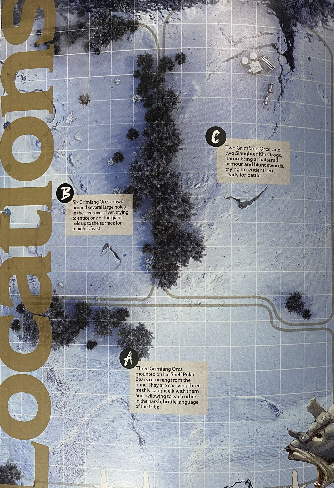
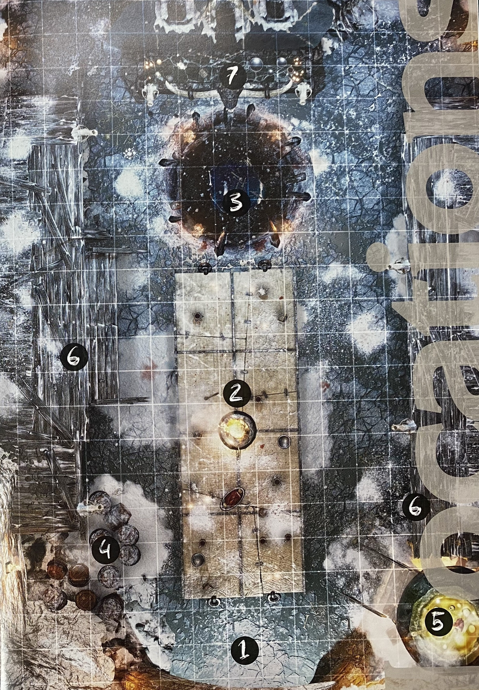

# Hall of the Orc King

## はじめに
**Epic Encountersへようこそ！ このガイドは、ファンタジーRPGをさらにレベルアップさせるために作られたものです。**

このブックレットには、エンカウンターの運営方法、 各ターンごとに緊張感と興奮を高めるためのヒント、 プレイヤーを油断させないための工夫が詰め込まれています—— もちろん、この戦いの後に彼らがまだ立っていられるのならの話ですが！

### プレイ前のチェックリスト
準備は万全か？ 下記のリストを確認しよう！

- この本を読んだか？ インスピレーションを得るだけでなく、ガイドとして活用しよう。 好きな部分を選んで使ってもいいし、すべてを採用しても構わない。 選択は君次第だ！

- プレイヤーたちは、ダイスとキャラクターシートを用意し、 何か“大きなこと”が迫っていると知っているか？

- バトルマップは準備万端、 その各エリアや戦闘中に起こり得る様々なイベントを把握しているか？

- 楽しむ準備はできているか？ 何よりも重要なのは、これは“ゲーム”だということ。 GMとしてルールのいくつかを忘れることがあっても問題ない！ プレイヤーたちが笑い、盛り上がっているなら、君は間違いなく正しくゲームを進行できている！

### 開始前に (Before Starting)

Epic Encountersは、3つのプレイ階層 (Tier of Play) に分かれており、 幅広いプレイヤーグループに適用できるよう設計されている。  
この冒険中に発生するダメージレベルや難易度クラス (DC) の判定は、 下記の表に示された3つのプレイ階層に応じて決定される。  
テキスト内で「標準DCチェック」や「標準ダメージを受ける」と記載されている場合、 適切な階層のボックスを参照すること。 例えば、低レベルのプレイ階層で標準ダメージを受ける場合、1d4ポイントのダメージとなる。  

このエンカウンターは中レベルプレイ向けに設計されている。 しかし、熟練したGMが適切な調整を行えば、高レベルプレイにも対応可能となる。  

### **プレイ階層 (Tier of Play)**
| プレイ階層 | 難易度クラス (DC) | ダメージレベル |
|------------|----------------|----------------|
| **低レベル (1〜4レベル)** | 12 | 1d4 |
| **中レベル (5〜10レベル)** | 14 | 1d8 |
| **高レベル (10レベル以上)** | 18 | 1d10 |

## アドベンチャーの概要
グリムファング・オーク・キングは山中の地下王国に住まいを構えた。血と虐殺によって築かれたその王国において、オーク王は彼に立ち向かったすべての者を打ち倒してきた。彼の眼前に踏み入れた者で、ゴブリン以外の種族は決して生きて帰ることはできない。  
オーク王の軍勢は日々増え続けている。エルフやドワーフ、人間を永遠に葬り去るその時を待ちわびながら。グリムファング・オークたちは、最も強靭で、最も獰猛で、最も恐るべき戦士たちだ。  
山頂の地下氷窟に君臨するその冷酷な暴君について、数多くの噂が渦巻いている。だが、それらのいくつが真実なのか、知る者はいない。勇気を持って確かめようとする者もいなかった。ひょっとすると、その王国にはわずか十数体のオークしかいないのかもしれない。  
あるいは、恐るべき大軍勢がそこに潜み、鋭利な刃を研ぎながら、突如として怒涛の如く襲い掛かる機会を待っているのかもしれない。オーク王の根城は未だ確定されていない——これは、通常のオークの大胆かつ露骨な行動とは異なる。通常であれば、オークの野営地がどこにあるかは容易に分かる。幾つもの篝火の煙が巨大な天幕の上に渦巻いているからだ。  
数百回に及ぶ宴と略奪の残骸が、野営地の周囲に深く積み上げられているものだ。 だが、ここでは違う……オーク王の手下たちは襲撃を仕掛けた後、雪の中へと消え去る。まるで冬の一部であるかのように。地元の者たちはすでに、彼らが単なるオークではなく「何か別の存在」であると信じ始めていた。  
だが、君は違う考えを持っている。そして、それを証明しなければならない。グリムファング・オークたちの足跡を辿り、彼らの根城を突き止め、オーク王の棲み処へと戦いを持ち込む必要がある。慎重に雪の中に残された痕跡を探し、それを追っていく——北方の冷たいツンドラを越え、険しい山々の奥深くへと進んでいった。そして、ついに君の目の前に彼らの巣が現れる……しかし、オーク王の広間に侵入する前に、君は途方もない数のオークを突破しなければならない。  
そして、これらのオークについて奇妙な伝説が語り継がれている……それはまるで、彼らが寒さをしのぐために身にまとった厚い毛皮のように、噂と憶測に覆われている。次のページには、いくつかの伝承が記されている——果たしてそれらはいかほどの真実を含んでいるのか、あるいは単に山中の死を恐れた者たちが生み出した荒唐無稽な神話なのか？  
それを見極めるのは、君の使命だ！

- オーク王は死ぬことがない。彼は砕かれ、血にまみれ、切り刻まれても……やがてその魂は肉体へと戻り、再び命の炎を灯す。どれほど深い傷を負おうとも、時間とともに肉と筋が繋がり、癒され、彼は再び戦いの先頭に立つ。

- これらのオークは先祖伝来の神々を捨て、今では氷の中の顔を崇拝している。この古き神は、この地に広がる深い氷河の奥でオークたちに見いだされた。彼らが信仰と祈りを捧げるうちに、その囁きは徐々に彼らを変えた——彼らはもはやただのオークではない。野蛮さは減り、より致命的な存在へと変貌していった。

- この地の捕食者たちはオークたちと奇妙な絆を結んでいる。ホッキョクグマ、氷狼、さらにはレモラスまでもが彼らを襲わず、むしろ協力し合っている。狩りの獲物の残骸や骨を食べることで共存し、時にはオークたちの狩りを積極的に助けることさえある。特にホッキョクグマは多くのオークたちと深い絆を結び、乗り手としての役割すら受け入れている。ただし、愚かにもその絆を裏切り、虐待する者は、間違いなくその獣の餌となる運命を辿るだろう。

- オーク王はこの地に長く住まう古の冷酷なフロスト・ジャイアントと同盟を結んだ。彼らの隠された棲み処は、実はフロスト・ジャイアントが築き上げた広大な地下のトンネル網の一部なのだ。

- このフロスト・ジャイアントとの絆はオークたちを変質させた。彼らの肉体には氷の結晶が根付き、成長し、分裂し、より多くの肉を侵食し、最終的に結晶だけを残していく。

- 他のオークたちはオーク王を恐れている。彼の背信、野心、そして彼の従者たちの異質さを嫌っている。これまでに少なくとも二度、オーク王を暗殺しようとする試みが他の首領によって行われた。しかし、どちらも成功したとされているにも関わらず、オーク王は蘇り、以前にも増して残忍な略奪を続けている。

- オーク王が死から蘇るたびに、その野望はさらに大きく、恐ろしく、途方もないものへと膨れ上がる。彼の従者たちの中には、彼が最終的に何になるのかを恐れる者もいる。しかし、一方で彼を「オークの理想形」と見なす者もいる——揺るぎなく、止まることなく、容赦なき存在。

- オーク王の広間には無数の戦利品が積み上げられているという。金や財宝が溢れかえっているという話もあれば、千人の人間の皮が天井から吊り下げられているとも言われる。あるいは、歴代の偉大なるオークの首領たちの頭が槍に突き刺され、オーク王が彼らと語り合い、知恵を授かっているとも囁かれている。しかし、その真実を知る者はいない。
誰かがその答えを見つける必要があるのだ。

**プレイヤーキャラクターたちを、オーク王との必死の戦いへと駆り立てるものは何か？ 何が彼らを北へと誘ったのか——氷と岩に覆われた凍てつく地へ、都市の快適さも太陽の温もりも届かぬ場所へと。 ここでは、一つひとつの呼吸が空気の中に留まり、己の命の儚さを思い出させる。 この地にはただ「死」しかない。 それでもなお、君はここへ引き寄せられた。 いったい、それは何だったのか？**

- オーク王の襲撃は、思わぬ者たちの関心を引いてしまった。ついに彼は強力な商人連盟の怒りを買い、莫大な賞金が彼の首にかけられた。 君は、それを回収しに来たのだ。

- 迷い、凍え、雪の中を必死に進むうちに、かすかに残るオークの足跡を見つけた……彼らは隠そうとしたが、君はそれを見破った。 避難場所になるか？そうかもしれない——オークを何体か倒す必要はあるだろうが、このままではいずれ死ぬ。 失うものなどあるか？

- ツンドラの獣たちの様子がおかしい。これまで人間、エルフ、ハーフリング、ドワーフの居住地に近づくことはなかったのに、今は異様なほど接近している。 なぜだ？何が彼らをこの土地へと追いやっているのか？

- 古き神が目覚めた。氷原の奥深くで。 その冷酷で古代の意識の触手が、感応できる者たちには感じ取れる。オークたちは彼の支配下にあり、その目覚めた怒りをもたらしたのだ。

- 地域の町や砦に向けて勅令が発せられた——オーク王に跪け、さもなくば死を。 ほとんどの者はそれを笑い飛ばし、そんな無礼で軽率な要求を破り捨てた。 だが、一週間前、シュウェルンドの町との連絡が完全に途絶えた。 かろうじて生き延びて他の村へたどり着いた数少ない生存者たちは、氷の中から現れ、そして消え去る悪魔のようなオークのことを語った。 今や恐怖は広がり、英雄が求められている——シュウェルンドで何が起こったのかを突き止め、それを二度と繰り返させないために。

- 魔法使いグリムナル・イリントゥムが、驚くほどの賞金を提供する。 彼の望みは不死のオーク王を生け捕りにすること、あるいは可能ならば死体でもよい。 彼はこの奇跡的な不死性の原因を突き止めるための実験をしたいと考えている。

- 財宝——古代の財宝。 オーク王は何千年もの間、戦利品を収集してきた。 それらすべてが、彼の広間の闇の中で眠っている。 ただ世界のねじれた根の奥深くへと踏み入り、影の中で待ち構えるオーク王のもとへ辿り着くだけで、君の想像を超える富が手に入るだろう。

- かつて、遠い昔——オーク王を名乗る存在が君の村を襲撃し、家族を虐殺した。 幾十年にもわたり、その獣の痕跡を追い続け、地の果てまで旅をしてきた君は、ついに彼の隠れ家を見つけた。 あとは、中へ踏み込むだけだ。

## 概要
**冒険は、プレイヤーキャラクターたちがオーク王の広間へと続く雪深いツンドラに直面する場面から始まる。 この土地は危険に満ち、渡るのは容易ではない。 広間への入口に至るまでの間には、複数のオークの部隊が待ち構えている。現在、オーク王は宴の準備を進めている。 彼の部族は狩りや漁に精を出し、祭りのための支度を整えているのだ。 プレイヤーキャラクターたちがこうした前哨部隊を突破できれば、広間へと潜入することができる——ちょうど宴の幕が上がる直前に。**

冒険は、プレイヤーキャラクターたちがオーク王の広間へと続く雪深いツンドラに直面する場面から始まる。 この土地は危険に満ち、渡るのは容易ではない。 広間への入口に至るまでの間には、複数のオークの部隊が待ち構えている。  
現在、オーク王は宴の準備を進めている。 彼の部族は狩りや漁に精を出し、祭りのための支度を整えているのだ。 プレイヤーキャラクターたちがこうした前哨部隊を突破できれば、広間へと潜入することができる——ちょうど宴の幕が上がる直前に。  

### 天候
雪はほぼ絶え間なく降り続き、風は鋭く冷たく、容赦なく吹きつける。 山の気候は、そこに住まう者たちと同じく、獰猛で冷酷なのだ。  
プレイヤーキャラクターが雪の中を進み、オークの鋭い刃の間を抜けようとする時、 この過酷な天候が彼らの旅路をさらに困難なものにするだろう。  
以下の表を使って、彼らが直面する気象条件を決定し、それがどのような影響を及ぼすかを確認しよう！ この天候は、プレイヤーキャラクターがオーク王の広間の内部へ入るまで続く。　　

| **D6**               | **天候** | **説明** |  
|-----------------------------|------------------|-----|
|1|**雪の吹き溜まり (Snow Drifts)**|深い雪のため、移動が非常に困難になる… 徒歩のクリーチャーは移動速度が半減する。 ただし、オークの乗騎は深い雪の中を移動することに慣れているため、このルールの影響を受けない。|
|2|**みぞれ (Sleet)**|氷混じりの雨により、視界はほぼ完全に遮られる。 すべての遠隔攻撃は不利 (Disadvantage) となる。|
|3|**激しい降雨 (Raining Hard)**|豪雨により地面は滑りやすく、物をしっかり掴むのが困難になる。 ファンブル (Fumble) した場合、クリーチャーは武器を落とす。|
|4|**冷たい風 (A Chill Wind)**|山から吹き下ろす風は、矢じりのように鋭く、鎧の隙間から侵入しやすい。 すべての遠隔武器攻撃は命中判定に +1 の修正を受ける。|
|5|**嵐の到来 (A Storm Coming)**|空気中に漂うオゾンの匂い。 髪の毛や指先に走る電気の気配。 すべての近接武器攻撃は、命中時に追加で 1d3 の電気ダメージを与える。|
|6|**猛吹雪 (Blizzard)**|山から氷の嵐が渦巻くように吹き下ろしてくる。 上記のすべての効果が同時に適用される！|

## A. 狩人たち（The Hunters）
> **アイスシェルフ・ホッキョクグマ**に騎乗した3体の**グリムファング・オーク**が狩りから帰還する。 彼らは新たに仕留めた3頭のヘラジカを運びながら、 部族特有の荒々しく鋭い言葉で互いに叫び合っている。

狩りを成功させた帰途、アイスシェルフ・ホッキョクグマに騎乗した3体の**グリムファング・オーク**が、広間の入口へと続く森林の岩棚へ向かって急な尾根を登っている。この自然の障壁が、広間を間諜や好奇の目から隠している。  
この場所には鋭い岬があり、夏ならばそこを川が勢いよく流れる……はずだった。 しかし今は、凍てついた鋭利な氷の塊が突き出ており、滝全体が完全に凍結している。 狩人たちはゆっくりと進んでいる。彼らの乗騎は追跡と険しい登りの旅路に疲れ果てている。  

ホッキョクグマの傍を忍び足で通り抜けるのは極めて困難だ。 彼らは鋭敏な嗅覚を持ち、この地を知り尽くしている。 これを成功させるには、ステルス判定が必要となるが、このゾーンではすべてのステルス判定が不利 (Disadvantage) となる。  
もしプレイヤーキャラクターたちが騎乗したオークとの戦闘を選ぶ場合、オークたちは喜んで戦いを受け入れる。 彼らは槍を即席のランスとして構え、敵を串刺しにするべく突撃する。 援軍を呼ぶことはしない——この戦いを自身の栄光を掴む機会と見ているためだ。 それに、吹きすさぶ風の音のせいで、誰も彼らの叫びを聞くことはできないだろう。  

急な尾根は戦闘を非常に困難なものにする。 もし伏せ状態 (Prone) になった場合、10フィート下の崖縁へと滑り落ちる。 この滑落を筋力 (Strength) や敏捷力 (Dexterity) チェックで食い止めることはできない。 地面はあまりにも滑りやすく、雪は深すぎる——グリップを得る前に完全に滑ってしまうのだ。  
もしプレイヤーキャラクターが不運にも戦闘マップの指定された崖際の地点から滑り落ちると、 敏捷力セーヴィングスロー (Dexterity saving throw) で崖の縁を掴もうと試みることができる。 失敗すると、転落による標準的な殴打ダメージを受け、次のターンで崖を登り直さなければならない。 その間、戦闘マップから離脱することになり、登り切るまで戦闘に影響を与えることはできない。

## B. 漁をするオークたち (Gone Fishing)
> 6体の**グリムファング・オーク**が、凍りついた川に開けられた複数の大穴の周りに集まっている。 彼らは今夜の宴のために、巨大なウナギを水面へ誘い出そうとしている。

ゾーンBは氷結した川で、周囲には細く伸びる木々が立ち並んでいる。 氷はプレイヤーキャラクターたちの重さには十分耐えられるが、決して割れないわけではない！ このゾーンでは、オークたちが氷に幾つもの大穴を開け、そこに群がっている。 数体のオークは水中に網を垂らしており、別の者たちは槍の柄で氷の表面を叩いている。  
彼らは川のウナギを狙い、完全に漁に集中している。 広間での宴のために、できる限り獲物を手に入れようとしているのだ。 オークたちは槍と弓を持っており、ウナギを誘い出すと、遠くから矢で射抜こうとしている。 しかし、今のところ成功率は低い。  

### ステルス行動  
このオークたちの傍をこっそり抜けるには、敏捷力 (ステルス) 判定が必要となる。 しかし、オークたちは狩りに夢中になっているため、すべてのステルス判定は有利 (Advantage) を得る！  
もしオークたちがプレイヤーキャラクターの存在に気付く、あるいは攻撃された場合、彼らは波状攻撃を仕掛ける。 半数が前線でキャラクターたちを包囲し、動きを封じ、もう半数は弓矢で攻撃する！ さらに、彼らはプレイヤーキャラクターを氷穴へ追い込もうとする。 ウナギに止めを刺させるためだ。  
もしプレイヤーキャラクターが、氷穴から5フィート以内で近接攻撃を受けダメージを負った場合、 敏捷力セーヴィングスロー (Dexterity saving throw) を行い、失敗すれば凍った水中に落下する！

### 氷の耐久値
プレイヤーキャラクターの足元の氷は50ヒットポイントを持つ。 攻撃を外すと、氷自体にダメージを与えてしまう！  
氷の耐久値が0になると、上に立っていたすべてのクリーチャーが氷の裂け目へと落下し、冷たい水中へ沈む。 水中では視界が極めて悪く、プレイヤーキャラクターは最大10フィート先しか見えない。 さらに、冷たい水の中にいる間は毎ターン耐久力 (Constitution) セーヴィングスローが必要であり、失敗すると通常の冷気ダメージを受ける。  
オークたちはこれらの効果を完全に無視する。  

### 撤退の可能性  
これらのオークは基本的に援軍を呼ばない。 しかし、彼らの数が半分に減り、逃げる余地がある場合、 ゾーンCへ撤退し、仲間を集めることを試みる！ そしてゾーンCにて最終的な防衛戦を展開する。

## C. 調整作業 (Hammering Out the Kinks)
> 2体の**グリムファング・オーク**と2体の**スローター・キン・オログ**が、打ちのめされた鎧と鈍った剣を叩きながら修復している。 彼らは戦いに備えて装備を整えようとしている。

オーク王の広間への巨大な扉が、ゾーンCの中心的な要素となっている。 その扉は頑丈なオーク材で作られており、典型的なオークの工法が見て取れる——異なるサイズの板を無理矢理打ち付け、巨大な鉄のボルトで固定された粗野な作りだが、その規模と強度は圧倒的である。  
ゾーンCのオークたちは、様々な作業に従事している。 彼らは鎧の手入れをし、武器の修理を行い、装備を戦闘に適した状態に保っている。 明らかに、彼らの準備している宴は、広間の外の土地への大規模な襲撃の前触れだ。  
武器の修理や鍛造の音は、ある程度プレイヤーキャラクターの接近を隠してくれるものの、 このオークたちは漁をしていた者たちよりも警戒心が強い。 そのため、彼らをこっそり通り抜けるには、敏捷力 (ステルス) 判定が必要となる。  

### オークの攻撃手段
オークたちは近くに大量の工具を保管している。 もしプレイヤーキャラクターが注意を引いてしまうと、オークたちは最初の攻撃手段として、それらの工具を全力で投げつけてくる！
ハンマー、ノミ、その他の工具が雨のように降り注ぎ、 成功した攻撃ごとに標準的な殴打ダメージを与える。  
オークたちはこの遠距離攻撃を2ターン続け、数発の痛烈な打撃を与えた後、素早く距離を詰めてくる。  

### 援軍の到来
ゾーンCはオーク王の広間に近いため、援軍が容易に呼び出せる。 もしプレイヤーキャラクターがオークたちを3ラウンド以内に排除できない場合、 アイスシェルフ・ホッキョクグマに騎乗した2体の**グリムファング・オーク**が現れ、騒ぎを確かめに来る！  
彼らは戦闘を確認すると、突撃の機会をうかがい、 プレイヤーキャラクターの露出した側面へと攻撃を仕掛ける。

### オーク王の広間への侵入方法
ゾーンCのオークたちを片付けた後、プレイヤーキャラクターはオーク王の広間に侵入する必要がある。 以下のように、いくつかの方法が考えられる。  

- 知覚力 (Wisdom: Perception) 判定に成功すると、扉の右上の角にある大きな隙間を発見できる。 この隙間は、人間やドラゴンボーンが通り抜けられるほど広い。 隙間に到達するには、敏捷力 (Dexterity) 判定が必要だが、成功すると広間を囲む桟橋 (gantry) に到達できる。

- 単純に扉を開けて堂々と侵入することもできる。 しかし、扉をこじ開けるには筋力 (Strength) 判定が必要となり、 そのため、広間へ入った際に行うステルス判定は不利 (Disadvantage) となる。 何しろ、正面扉から堂々と入ってしまうのだから！

- 扉の蝶番が強制的に氷へと食い込ませて固定されており、そこには狭い隙間がある。 その隙間を通り抜けるには敏捷力 (Dexterity) 判定が必要だが、成功すれば気付かれずに広間へと侵入できる！

## オーク王の広間
オーク王の広間は、氷を彫刻して作られた巨大な宴会場である。 その造形は非常に精巧であり、オークたち単独では到底成しえなかった技術と専門知識が込められている。  
広間の両側には、荒削りな氷へと打ち込まれた木製の桟橋 (gantry) が設置されている。 天井からは、粗雑ながら頑丈な鉄製のシャンデリアがぶら下がっており、 太い縄と巨大な黒鉄の鉤爪 (claw) によって支えられている。  
巨大な宴席が広間の大部分を占めており、奥の高座ではオーク王が鎮座している。 彼は巨大なヘラジカの腿肉を噛みしめながら、満足げに食事を楽しんでいる。  
広間の大扉の両側には、宴のための物資が積み上げられている。 左側には、オークの酒 (grog) が入った無数の樽が山積みされている。 その酒を醸造・貯蔵・配分する役割を担うオーク・グロッグ・マスターたちが、そこに集まっている。  
反対側では、2人のオーク料理人が料理を作っている。 それは、食べ物と呼べるかどうかも怪しい代物ではあるが……。  
そして、広間の中央には戦闘用の闘技場が掘られている。 そこでは2人の剣闘士 (gladiators) がオーク王の歓心を得るため、死闘を繰り広げている……。

## 1. 広間への侵入 (Entering the Hall)
プレイヤーキャラクターが宴会場へ侵入する方法によって、到達する位置が異なる。  
- 扉をよじ登った場合 → 扉の右側にある桟橋 (gantry) に到達し、料理鍋の上に位置する！
- 扉を開けて堂々と入った場合 → まさに扉の前に立つことになり、テーブルのオークたちから丸見えになる！
- 扉と氷壁の狭い隙間をすり抜けた場合 → グロッグ樽の山の後ろへと忍び込む！

## 2. 宴会のテーブル (The Feasting Table)
広間の中央には長大な宴席が堂々と配置されている。 このテーブルの周囲には、10体の**グリムファング・オーク**が座り、食事とグロッグをできるだけ貪るようにしている。  
また、4体の**オーク**は**アイスシェルフ・ホッキョクグマ**の乗騎と共に座っている。 彼らは獣たちへ肉片を投げ与えたり、時には愛情を込めた力強い組み合いを楽しんでいる。  
テーブルの上には食料が山積みされ、さらにグロッグの樽が視界を遮る障壁となっている。 もしプレイヤーキャラクターが正面扉から侵入し、まだ隠れたいと考えている場合、この樽を遮蔽物として活用することも可能だ。  

### テーブルの利用
このテーブルは十分な大きさがあり、隠れるのに適している。 テーブルの下に隠れた場合、ステルス判定は有利 (Advantage) を得て、AC に +1 のボーナスが付与される。  
一方で、テーブルの上へ登るのは少し危険だ。 これはオーク流の内装であるため、よじ登るには敏捷力 (Dexterity) 判定が必要となる。 さらに、テーブルの上でダメージを受けた場合、敏捷力セーヴィングスロー (Dexterity saving throw) を行わなければならず、失敗するとテーブルが崩壊し、転落する！ 落下した場合、標準的な殴打ダメージを受け、伏せ状態 (Prone) になる。  

### 宴の流れ
毎ターン、1〜2体のオークが料理鍋や樽へ移動し、食器や酒杯を満たすために動く。 さらに、テーブル周囲では常に拳闘や組み合いの乱闘が発生している。  
もし宴会場で戦闘が発生すると、テーブル周囲のオークたちはすぐに立ち上がり、戦闘に参加する！ 彼らは酔った歓声をあげながら戦いを楽しみ、最初に視界に入ったプレイヤーキャラクターへ向かって突撃し、数の力で押し潰そうとする。  

## 3. 戦闘ピット (The Fighting Pit)
オークたちにとって力と勇気 (そして愚かさ) を試す戦いは、最も一般的な娯楽の一つだ。 しかし、宴のテーブル周りで行われる陽気な乱闘とは違い、これはより深刻な戦いである。  
オーク王の前で臆病さを見せた者のみが、死を賭した戦いへと追いやられる。 勝者は王の目において名誉を回復し、部族の戦士として復帰することができる。 敗者はそのまま朽ち果てる運命を辿る。  
プレイヤーキャラクターが広間にいる間、2体の**グリムファング・オーク剣闘士**が特に残酷な戦いを繰り広げている。 血が飛び散り、刃がぶつかり合い、打ち付けられた傷ついた肉を切り裂く音は、酔いしれたオークたちの咆哮や酒宴の歌声をも超えて響き渡る。  
オーク王とその側近たちは、この戦いに深く没頭している。 側近たちは歓声を上げ、王も時折満足げに特に見事な一撃に頷きを見せる。　　

### 戦闘ピットの危険性  
戦闘ピットから5フィート以内でダメージを受けたプレイヤーキャラクターは、敏捷力 (Dexterity) セーヴィングスローを行わなければならない！ 失敗すると、氷のピットへと転落する！ 落下時には標準的な殴打ダメージを受ける——氷上への転落は非常に痛烈なものとなる。  
さらに、ピットへ落ちた瞬間、剣闘士たちは互いを攻撃することを完全に忘れ、プレイヤーキャラクターに集中する！ 彼らは狂ったように武器を振り回し、地面へと引きずり倒そうとする—— そして、止めの一撃を叩き込もうとするのだ……。

### ピットからの脱出
ピットから這い上がるには、敏捷力 (アクロバット) または筋力 (運動) 判定が必要となる。 ピットの壁は切り立っており、滑りやすい。 重装備のキャラクターは、この敏捷力または筋力判定を不利 (Disadvantage) で行う。  

## 4. グロッグ倉庫 (The Grog Store)
広間の左側の扉の横には、巨大な樽の山が積み上げられている。 そこでは2体の**グリムファング・オーク・グロッグ・マスター**が、この酒の管理を厳重に行っている。  
これらの樽には、すべてオークのグロッグ——極めて強烈な酒が詰められている。 この酒は、オークの消化器官のみが耐えられるほど強烈であり、加えて非常に引火しやすい。  
もしプレイヤーキャラクターが火属性ダメージを与える呪文を唱えるか、 火属性ダメージを持つ武器で攻撃し、グロッグ樽への攻撃が成功した場合、樽は爆発する！  
この爆発は、半径5フィート内のクリーチャーすべてに標準的な火炎ダメージを与え、 さらに巻き込まれたクリーチャーは5フィート後退する。  
プレイヤーキャラクターが樽から直接グロッグを飲む場合は、隣接する表を参照して結果を決定する。

### グロッグ・マスターたち  
この2体の**グロッグ・マスター**は、 自分たちの酒に対する強いこだわりを持ち、常に樽を監視している。  
彼らは定期的に樽を叩いて味を確認し、 さらに腰に下げたハーブの袋から香草を振りかけたり、樽の中へ混ぜたりしている。  
彼らは常に半ば酔っており、その影響で非常に手強い戦士である。 しかし、彼らは戦闘の戦略を立てることには興味がない。  
もしプレイヤーキャラクターが彼らの近くで見つかると、彼らはすぐに突撃し、酒杯で殴りかかってくる！ もしプレイヤーキャラクターが樽を破壊すると、彼らは激怒し、制御不能な狂乱状態に陥る！  
その結果、彼らは口から泡を吹きながら、破壊した者へ一直線に突撃し、引き裂こうとする。  

| **D6**               |**効果**|**説明**|  
|-----------------------------|------------------|-----|
|1|**毒を受けた！**|とんでもなくひどい酒を飲んでしまった……。標準的な毒ダメージを受ける。|
|2|**全て吐き戻す！**|グロッグの影響で激しく体調を崩す。次のラウンドは嘔吐し続けるため、移動も行動もできない。|
|3|**酔いどれ狂戦士！**|このグロッグはあまりにも強烈で、即座に酔い潰れる。 すべての判定は1時間の間、不利 (Disadvantage) となる。 ただし、耐久力 (Constitution) セーヴィングスローに成功すれば影響を回避できる。|
|4|**なぜ部屋が回っている…？**|視界が突然ぼやける……これはまずい。 1ターンの間、すべての攻撃ロールは不利 (Disadvantage) となる。|
|5|**何を見ているんだ？！**|激情の怒りに突如として囚われる……。 1分間、狂戦士状態 (Berserk) のように振る舞う。 この間、筋力 (Strength) に関連する判定と攻撃ロールは有利 (Advantage) となる。 さらに、殴打 (Bludgeoning)、刺突 (Piercing)、斬撃 (Slashing) ダメージに対する耐性を得る。|
|6|**意外と悪くないかも！**|この酒は意外にもそこそこ飲める味だ……。 1d8のヒットポイントを回復する！|

## 5. 料理鍋 (The Cooking Pot)
広間の樽の反対側には、大きな焚火が燃え盛っている。 この火は木材と泥炭を使って燃やされており、激しく燃え上がっている。 一部のオーク——氷と肉が融合しつつある者たち——は火を恐れ、遠ざかるが、 大半のオークは特に気にしていないようだ。  

この焚火の上には、巨大な黒錫製の大鍋が乗せられている。 その表面にはドワーフの紋様が刻まれている—— 明らかに、オークたちが過去にドワーフの砦を略奪した際に持ち出した戦利品である。  

鍋の傍では、2体の**グリムファング・オーク**料理人が作業している。 彼らは巨大な肉切包丁と肉用ノコギリを持ち、 様々な食材を食べられるサイズに切り刻んでいる—— 調理とは呼べないほど乱暴な手順だ。 つまり、切って鍋へ放り込むだけ！  

大きな木製テーブルの上には、食材となる死骸が積み上げられている。 そこには、頭を切り落とされたウナギの死骸、切り刻まれた狼、複数のウサギ、 さらには、ほぼ完全なイエティの死骸が並んでおり、様々な解体段階にある。  

### 鍋の危険性
鍋へ近づくことは非常に危険だ……。 その強烈な悪臭は、5フィート以内にいるキャラクターすべてに耐久力 (Constitution) セーヴィングスローを要求する！ 失敗すると、ひどい吐き気に襲われ、標準的な毒ダメージを受ける！  
また、鍋から15フィート以内にいるキャラクターは、すべての判定を不利 (Disadvantage) で行う。 理由は単純——あまりにも酷い悪臭が鼻腔を満たし、集中が困難になるためである。  
さらに鍋へ投げ込まれることは最悪の結末となる。 プレイヤーキャラクターは徒歩のオークを鍋へ押し込むことが可能だが、当然オークたちもプレイヤーキャラクターを鍋へ放り込もうとする！  
鍋の近く (5フィート以内) で、もう一体のクリーチャーと接している場合、 対抗判定の筋力チェック (Strength) に成功すると、相手を鍋へ投げ込むことができる！  
鍋の腐った煮汁は、皮膚にまとわりつき、毎ターン標準的な酸ダメージを与える！ 鍋から這い上がるには、標準DCの敏捷力 (Dexterity) チェックが必要となる。

### オーク料理人の戦闘能力
オークの料理人たちは極めて厄介な敵である。 彼らはプレイヤーキャラクターを視認すると、即座に攻撃態勢に入る！  
彼らは巨大な肉用ノコギリを片手に構え、 もう片手で最も大きな肉塊を掴み、武器として振り回す！  
ボーナスアクションとして、オーク料理人は以下の表を使用し、即席の武器による無料攻撃を行うことができる。  

| **D4**               |**即席武器 (Improvised Weapon)**|  
|-----------------------------|------------------|
|1|ウナギの死骸 (Eel corpse) オークは長くしなやかなウナギを掴み、それを鞭のように振るう！ 標準的な斬撃ダメージを与える。（敏捷武器、間合いあり）|
|2|骨を投げろ！ (Throw me a bone) オークは長く鋭い骨を拾い、それを槍のように投げつける！ 標準的な刺突ダメージを与える。（投擲距離 30/120フィート）|
|3|マンティコアの棘 (Manticore Quill) オークは鋭い棘の束を掴み、それをダーツのように投げつける！ 1d4の刺突ダメージを与える。（敏捷武器、投擲距離 20/60フィート）|
|4|イエティの脚 (Yeti Leg) オークは巨大な前脚を掴み、それを頭上から振り下ろす！ 1d10の殴打ダメージを与える。（重量武器、両手持ち）|

## 6. 桟橋 (The Gantry)
桟橋はオーク王の広間の周囲を巡る粗削りな歩道である。 それは側面に吊るされた複数の縄を使って登ることができ、 通常はオーク王の護衛目的として使用される……。  
だが、今日は様子が違う。 桟橋は完全に空——グロッグと食料が豊富すぎて、最も忠誠心の高いオークですら見張りを続けていない。 その結果、プレイヤーキャラクターがここへ登ることができれば、 広間全体を自由に見渡せる状態となり、オーク王への計画的な攻撃を仕掛けることが可能となる。  

広間の中央には、巨大な黒鉄製のシャンデリアが吊るされている。 これは洞窟の天井から太い縄と打ち込まれた金属製の鉤爪で固定されている。  
このシャンデリアへ到達するには、桟橋の左右から跳躍する必要があり、敏捷力 (アクロバット) 判定に成功しなければならない！ しかし、失敗した場合、プレイヤーキャラクターは真下の宴会テーブルへと落下し、標準的な殴打ダメージを受け、伏せ状態 (Prone) となる。 さらに、驚いたオークたち——そして、次第に怒り始めるオークたち——のど真ん中に降ってしまう。

### 桟橋へのアクセス
桟橋へ上るには、縄をよじ登る必要があり、敏捷力 (アクロバット) または筋力 (運動) 判定が必要となる。  
もしプレイヤーキャラクターの存在がオークたちに知られてしまうと、 広間のオークたちは素早く縄を登り、戦闘を仕掛けてくる！  
オークたちはプレイヤーキャラクターの逃走を防ぐために、桟橋上へ追い詰め、周囲を包囲し、数の力で圧倒しようとする。  

## 7. 高座 (The High Table)
オーク王の玉座が鎮座する高座は、オーク王が側近や助言者、最も強力な部下たちと共に座り、 宴の混沌を楽しむ場所である。  
**グリムファング・オーク王**は巨大な玉座に座り、 ヘラジカの腿肉をむさぼりながら、 血が流れ、グロッグが飲み干され、オークの勝利の咆哮が響き渡るたびに、満面の笑みを浮かべる。  
その隣には、**グリムファング・オーク・シャーマン**が控えている。 彼は分厚いローブに身を包み、その手の動きが異形の青い火花を空中に刻む。  
さらに、2体の**スローター・キン・オログ**の護衛が王の左右に立ち、 常に警戒し、わずかな挑発をも見逃さず、巨大な拳で頭蓋を砕く機会を伺っている。

### 高座 (The High Table)
高座は驚くほど質素であり、広がる焼かれたヘラジカを除けば、何も置かれていない。 オーク王は食器のような細かな気遣いなど一切興味を持たず、 手で肉を引き裂き、そのまま拳の中で頬張る——満足げに。

### 正面突破の場合
もしプレイヤーキャラクターが正面から攻撃を仕掛けるか、 あるいはオーク王へ到達する前に広間で発見された場合、 王はただ座って待つ。  
彼はほとんど動かず、戦闘を観察し、パーティの強みと弱点を見極めている。 戦闘中、よく見れば、彼が巧みな受け流しや強烈な一撃に静かに頷いているのが分かる。 しかし、過剰な魔法の演出には冷笑を浮かべ、 隣のシャーマンへ一瞥を送る——彼の隣にいるのが魔術師でなく戦士だったら良かったのに、という皮肉な視線だ。  
オーク王の軍勢が半数を失うと、 彼はゆっくりと立ち上がり、慎重に伸びをし、 背中に背負った巨大な戦鎚を抜き放つ。 シャーマンは素早く魔法の呪文を王に織り込むと、 彼はオログの護衛たちとともに戦場へと突撃する！  

### 奇襲攻撃が成功した場合
もしプレイヤーキャラクターの隠密行動が成功し、奇襲が可能になった場合、 オーク王は非常に驚くことになる。 その驚きは、大音量の笑い声となって爆発する！  
最初の攻撃が仕掛けられると、オログの護衛たちは王の周囲を固め、 彼へ向かう攻撃をできる限り防ぐ。 そして、反撃の機会をうかがいながら突撃の準備を整える。  

### オーク王の戦い方
オーク王は純粋な喜びを持って戦い、決して退却しない。 どれほどダメージを負おうと、 どれほど部下が倒れようと、 どれほど広間が荒れ果てようと、 彼はプレイヤーキャラクター全員が倒れるまで、 あるいは自身が倒れるまで戦い続ける——それが彼の流儀だ。

### オーク王の玉座の下に眠る財宝
オーク王の玉座の下には、小さな財宝の山が隠されている。 それは、彼が生涯にわたって略奪し続けた、最も貴重な品々の選りすぐりである。  
銀のティアラに宝石が散りばめられた、美しく場違いな品が、最も目を引くだろう。 すべてを合わせれば、この財宝の山は 2500gp で売却可能だ。  

### オーク王の最期
オーク王を倒すことは並外れた偉業であり、彼が死ぬ瞬間にも、彼は満面の笑みを浮かべる。 血が牙を染め、彼の瞳には本当に良い戦いだったという感謝の色が宿る。  
しかし——王の死によって、この冒険は終わりを迎えたのか？

> オーク王の瞳が閉じる瞬間、どこか近くから冷たい風が吹き付けるのを感じる。 彼の玉座の背後には、氷に切り開かれた穴がある……。
その奥から、巨大な生物の咆哮が響き渡る——それは今まさに、お前たちを目指して迫っている！